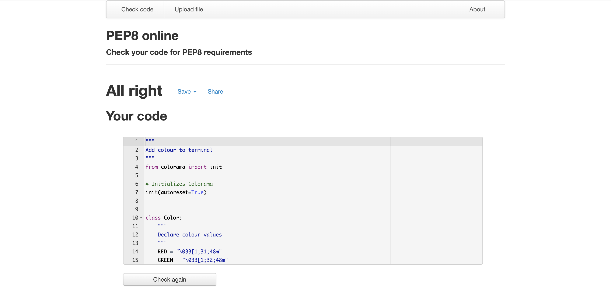

# HANGMAN GAME 

**Developer: John Constant**

💻 [Visit live website](https://ci3-pp3-hangman.herokuapp.com/)

## About

This is a command-line version of the classic Hangman game.

Hangman is a guessing game. A random word is selected from a word list, and the player tries to guess it by suggesting letters within a certain number of guesses.

## Table of Contents
  - [Project Goals](#project-goals)
    - [User Goals](#user-goals)
    - [Site Owner Goals](#site-owner-goals)
  - [User Experience](#user-experience)
    - [Target Audience](#target-audience)
    - [User Requirements and Expectations](#user-requirements-and-expectations)
    - [User Manual](#user-manual)
  - [User Stories](#user-stories)
    - [Users](#users)
    - [Site Owner](#site-owner)
  - [Technical Design](#technical-design)
    - [Flowchart](#flowchart)
  - [Technologies Used](#technologies-used)
    - [Languages](#languages)
    - [Frameworks & Tools](#frameworks--tools)
    - [Libraries](#libraries)
  - [Features](#features)
  - [Validation](#validation)
  - [Testing](#testing)
    - [Manual Testing](#manual-testing)
    - [Automated Testing](#automated-testing)
  - [Bugs](#bugs)
  - [Deployment](#deployment)
  - [Credits](#credits)
  - [Acknowledgements](#acknowledgements)

## Project Goals

### User Goals

- Play a fun and easy game with other player
- Be able to log in to an existing account

### Site Owner Goals

- Create a game that is easy and clear to user
- Ensure that users understand the purpose of the game
- Create a game that gives feedback to the user whilst playing

## User Experience

### Target Audience

There is no specific audience of this game. However, I would recommend that players are at least 5 years old.

### User Requirements and Expectations

- A simple, error-free game
- Straightforward navigation
- Game personalisation by entering the player's names
- Feedback on game results

### User Manual

Click here to view instructions

#### Welcome Screen
Upon inital start up of the game, the player is greeted by a welcome screen which consists of an ASCII art graphic with the name of the game.

#### Game rules
With the first option to view game rules, the users are presented with a short game rules and once read they can go back to the main menu.
Operation: Click any key and enter.

#### Play
With the Play Game option, users are asked if they have played the game before or not.
Operation: Input either 'Y' or 'N' and press enter key. 
1. Yes
2. No

#### Log in
If the user selects 'Yes', the player is asked to enter their email address. Once entered the player will need to enter their name and password associated with the account. If all values match what has been saved to the Google Sheet the user is presented with a successful logged in message.

#### Create account
If the user selects 'No', then they will need to create account by supplying their email address, name and a password. Once all details are entered and pass the validation check, an account is created for them, and a message is displayed notifying the player of account creation.

#### Choose Difficulty
Once logged in or account created the player is asked to choose their difficulty level. This difficulty level determines the number of incorrect guesses available to them. There are three difficulty levels, easy, medium or hard. Easy gives the player 8 incorrect guesses, Medium 7 and Hard 6 guesses.

If the player enters anything other than those three options they will be asked to re-enter their selection.

#### Game
Once the player has chosen their difficulty level the game begins. The player is presented with the word they need to guess with the letters replaced by dashes. The user is also asked to guess their first letter. The guess input is restricted to letters only and if they attempt to enter more than one letter at a time they will need to attempt their guess again until they enter a valid guess.

If the player guesses a correct letter, they are presented with a message indicating they guessed a correct letter. If the player guesses a letter that does not appear in the word they will need see a message indicating so along with a hangman graphic.

When the player either guesses the correct word or runs out of lives they will be asked whether they want to play another game. 

[Back to Table Of Contents](#table-of-contents)

## User Stories

### Users

1. I want to be greeted by a welcome screen
2. I want to personalise the game and enter my name
3. I want to be able to log in if I return to the game
4. I want to be able to create an account if I have never played before
5. I want to be able to choose my difficulty level
6. I want to receive a real time feedback throughout the game
7. I want to get a feedback when I win or lose the game
8. I want to be able to play multiple games when I'm logged in

### Site Owner

9. I want users to have a positive experience whilst playing the game
10. I want users to easily select options from the menu
11. I want user names and emails to be saved to Google Spreadsheet
12. I want the user to get feedback in case of wrong input
13. I want data entry to be validated, to guide the user on how to correctly format the input

[Back to Table Of Contents](#table-of-contents)

## Technical Design

### Flowchart

The following flowchart summarises the structure and logic of the application.

Flowchart

## Technologies Used

### Languages

- [Python](https://www.python.org/) programming language for the logic of the program

### Frameworks & Tools

- Microsoft Visio was used to draw program flowchart
- [Font Awesome](https://fontawesome.com/) - icons from Font Awesome were used in the footer below the program terminal
- [Git](https://git-scm.com/) was used for version control within VSCode to push the code to GitHub
- [GitHub](https://github.com/) was used as a remote repository to store project code
- [Google Cloud Platform](https://cloud.google.com/cloud-console/) was used to manage access and permissions to the Google Services such as Google auth, sheets etc.
- [Google Sheets](https://www.google.co.uk/sheets/about/) were used to store players details
- [Heroku Platform](https://dashboard.heroku.com/) was used to deploy the project into live environment
- [PEP8](http://pep8online.com/) was used to check my code against Python conventions
- [Visual Studio Code (VSCode)](https://code.visualstudio.com/)
VSCode was used to write the project code using Code Institute template

### Libraries

#### Python Libraries
- random - used to choose a random word from a list of words
- time - used to displayed delayed messages in the terminal
- [unittest](https://docs.python.org/3/library/unittest.html) - used to carry out testing on single units in validation.py file

#### Third Party Libraries
- [colorama](https://pypi.org/project/colorama/) - JUSTIFICATION: I used this library to add color to the terminal and enhance user experience. I marked warning/error information with color red and user feedback with blue and green
- [email_validator](https://pypi.org/project/email-validator/) - JUSTIFICATION: I used this library to validate if user email input is of the form name@example.com
- [gspread](https://docs.gspread.org/en/latest/) - JUSTIFICATION: I used gspread to add and manipulate data in my Google spreadsheet and to interact with Google APIs
- [google.oauth2.service_account](https://google-auth.readthedocs.io/en/master/) - JUSTIFICATION: module used to set up the authentification needed to access the Google API and connect my Service Account with the Credentials function. A creds.json file is created with all details the API needs to access the google account. In deployment to heroku this information is stored in the config var section.

[Back to Table Of Contents](#table-of-contents)

## Features

### Welcome Screen

- Provides user with graphic welcome message
- User stories covered: 1
 

    
Main Menu Screenshot

### Log in

- Log in if I have played the game before and created an account
- User stories covered: 2, 3, 10, 11, 13
 

    
Logged In Screenshot

### Create Account

- Create an account if I have never played the game before
- User stories covered: 2, 4, 10, 11, 13
 

    
Create Account Screenshot

### Choose Difficulty
- Choose difficulty level
- Select the number of guesses available to the player
- User stories covered: 5, 9, 12, 13
  

    
Choose Difficulty Screenshot

### Guess letters
- Guess individual letters
- Receive feedback if guess is invalid
- Receive feedback if guess is in the word
- Receive feedback if guess is not in the word
- User stories covered: 6, 9, 12, 13

    
Make Guess Screenshot

### Game Over
- Receive feedback when correct word is guessed
- Receive feedback when run out of guesses
- Receive feedback if game is over
- User stories covered: 2, 7, 9

    
Game Over Screenshot

[Back to Table Of Contents](#table-of-contents)

## Validation

[PEP8 Validation Service](http://pep8online.com/) was used to check the code for PEP8 requirements. All the code passes with no errors and no warnings to show.

PEP3 check for run.py

PEP3 check for validate_inputs.py

PEP3 check for colors.py

PEP3 check for unit_test.py

PEP3 check for auth.py

PEP3 check for hangman.py

## Testing

The testing approach is as follows:
1. Manual testing of user stories
2. Automated unit testing using the Python unittest library

## Bugs

| **Bug** | **Fix** |
| ------- | ------- |
| When selecting 'go back to main menu' option after the game has finished, the game title was not displayed | Correct the function's indentation |
| When selecting a correct menu option after a few wrong numeric inputs the relevant game option was not called | Move the while loop at the top within the function |
| Underscores within the game title were not displayed after deployment to Heroku portal | Changed color settings for yellow & red |
| Gradient background color does not take up the full screen size | Add background-attachment property |
| Players names input values are not displayed in the game – instead of name a “‘Player1’’s / ‘Player2’’s move.” is shown | Reassign a value of player1name & player2name to the indexed-0 value (name) input by the user in ‘create_new_players’ function |
| Users input data was recorded in the same row in four columns instead of 2 separate rows | Created a list of players and while loop inside the 'register_new_players' function for Google Spreadsheet update separately for two players |
| There were quite a few errors and warnings related to exceeded number of characters in line, whitespace within a blank line, trailing white spaces or missing white spaces around operators | Split the comments or print functions into two separate rows maintaining correct indentation. Followed a guidance within pep8 online tool and corrected all warnings and errors |

## Deployment

### Heroku
This application has been deployed from GitHub to Heroku by following the steps:

1. Create or log in to your account at heroku.com
2. Create a new app, add a unique app name (this project is named "ci-pp3-connect4") and choose your region
3. Click on create app
4. Go to "Settings"
5. Under Config Vars store any sensitive data you saved in .json file. Name 'Key' field, copy the .json file and paste it to 'Value' field. Also add a key 'PORT' and value '8000'.
6. Add required buildpacks (further dependencies). For this project, I set up 'Python' and 'node.js' in that order.
7. Go to "Deploy" and select "GitHub" in "Deployment method"
8. To link up our Heroku app to our Github repository code enter your repository name, click 'Search' and then 'Connect' when it shows below
9.  Choose the branch you want to buid your app from
10. If prefered, click on "Enable Automatic Deploys", which keeps the app up to date with your GitHub repository
11. Wait for the app to build. Once ready you will see the “App was successfully deployed” message and a 'View' button to take you to your deployed link.

### Forking the GitHub Repository
1. Go to the GitHub repository
2. Click on Fork button in top right corner
3. You will then have a copy of the repository in your own GitHub account.
   
### Making a Local Clone
1. Go to the GitHub repository 
2. Locate the Code button above the list of files and click it
3. Highlight the "HTTPS" button to clone with HTTPS and copy the link
4. Open Git Bash
5. Change the current working directory to the one where you want the cloned directory
6. Type git clone and paste the URL from the clipboard ($ git clone https://github.com/YOUR-USERNAME/YOUR-REPOSITORY)
7. Press Enter to create your local clone

[Back to Table Of Contents](#table-of-contents)

## Credits

### Code
- Aleksandra Haniok [Github](https://github.com/aleksandracodes/CI_PP3_Connect4) used as a guide for my unit tests and README.md
- [ASCII Art Generator](https://www.developmenttools.com/ascii-art-generator/#p=display&f=Graffiti&t=Type%20Something...) was used to create game title
- Code Institute - for git template IDE and "Love Sandwiches - Essentials Project" which helped me with connecting the Google Spreadsheet to my project.
- How to install a Python module, eg. [email validation](https://pypi.org/project/email-validator/Installing)
- [gspread documentation](https://docs.gspread.org/en/latest/user-guide.html) explained how to obtain a specific value from the google spreadsheet
- [Stack overflow](https://stackoverflow.com/questions/20302331/typing-effect-in-python) helped me create typing effect in games rules
- Youtube video on [Unit Test in Python](https://www.youtube.com/watch?v=1Lfv5tUGsn8) made by Socratica was very helpful to understand the concept of unit tesing
- Udemy ["The Modern Python 3 Bootcamp"](https://www.udemy.com/course/the-modern-python3-bootcamp/)
- Youtube tutorial [“How to Build a Hangman Game with Python”](https://www.youtube.com/watch?v=JNXmCOumNw0)
- Youtube tutorial [“How to build HANGMAN with Python in 10 MINUTES”](https://www.youtube.com/watch?v=m4nEnsavl6w)
- Youtube tutorial [“12 Beginner Python Projects - Coding Course”](https://www.youtube.com/watch?v=8ext9G7xspg)

## Acknowledgements
I would like to thank everyone who supported me in the development of this project:
- My mentor Mo for professional guidance, helpful feedback and words of encouragement whilst creating the project. Also, for encouraging me to learn about the unit test and including it within this project.
